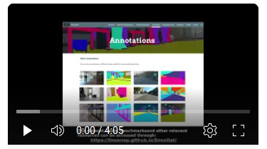

# EnvoDat dataset
<b>Official development and benchmarking kit for EnvoDat.</b> To replicate all the results in our [official project website](https://linusnep.github.io/EnvoDat/), we strongly recommend using this repository to run our pre-trained models, train on custom datasets, run inferences on the models and perform benchmark evaluation of the SoTA SLAM algorithms.


## Installations
kindly refer to the [INSTALL.md](docs/INSTALL.md) for installing the necessary tools and dependencies.

## Getting Started
To learn more about using EnvoDat for training, benchmarking, and evaluating supervised learning models and perception algorithms, kindly refer to [GET_STARTED.md](docs/GET_STARTED.md).

## Summary Video
[](https://youtu.be/5OcByVmTUPQ)

## License
This work is licensed under a [Creative Commons Attribution International 4.0 License](https://creativecommons.org/licenses/by/4.0/).

## Paper Citation

If you use this work in your research, please cite our [paper](https://arxiv.org/abs/2410.22200) and [dataset](https://linusnep.github.io/EnvoDat/) using the following BibTeX entry:

```
@misc{nwankwo2024envodatlargescalemultisensorydataset,
      title={EnvoDat: A Large-Scale Multisensory Dataset for Robotic Spatial Awareness and Semantic Reasoning in Heterogeneous Environments}, 
      author={Linus Nwankwo and Bjoern Ellensohn and Vedant Dave and Peter Hofer and Jan Forstner and Marlene Villneuve and Robert Galler and Elmar Rueckert},
      year={2024},
      eprint={2410.22200},
      archivePrefix={arXiv},
      primaryClass={cs.RO},
      url={https://arxiv.org/abs/2410.22200}, 
}
```

## Dataset Citation
```
@software{envodat,
    author = {Linus Nwankwo and Bjoern Ellensohn and Vedant Dave and Peter Hofer and Jan Forstner and Marlene Villneuve and Robert Galler and Elmar Rueckert},
    title = {EnvoDat: A Large-Scale Multisensory Dataset for Robotic Spatial Awareness and Semantic Reasoning in Heterogeneous Environments},
    note = {Project Website: \url{https://linusnep.github.io/EnvoDat/}},
    url={https://linusnep.github.io/EnvoDat/}
}
```

## Acknowledgement
This project has received funding from the Deutsche Forschungsgemeinschaft (DFG, German Research Foundation) - No \#430054590 (TRAIN).

