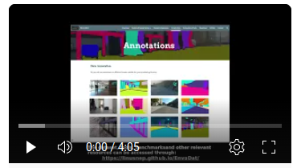

<div align="center">

# EnvoDat

**A Large-Scale Multisensory Dataset for Robotic Spatial Awareness and Semantic Reasoning in Heterogeneous Environments**

[](https://linusnep.github.io/EnvoDat/)
[](https://ieeexplore.ieee.org/document/11127594)
[](https://arxiv.org/abs/2410.22200)
[](https://creativecommons.org/licenses/by/4.0/)

[Website](https://linusnep.github.io/EnvoDat/) | [Get Started](docs/GET_STARTED.md) | [Install](docs/INSTALL.md) | [Leaderboard](docs/BENCHMARK.md) | [Download](https://sites.google.com/view/envodat/download)

</div>

<div align="center">
  
</div>

---

## Overview

EnvoDat is a large-scale, multisensory robotics dataset captured across **heterogeneous indoor, outdoor, and subterranean environments**, with annotations and ground truth designed for two families of tasks:

1. **Spatial awareness** — SLAM and odometry benchmarking under dynamic entities, varying illumination, opaque surfaces, low/zero-visibility, and feature-sparse conditions.
2. **Semantic reasoning** — object detection and semantic perception on non-standard objects, terrain, and lighting that differ from common household/urban datasets.

This repository is the **development and benchmarking kit** for the dataset. It provides the tooling to reproduce the perception experiments, evaluate SLAM trajectories, and submit results to the public leaderboard. The raw sensor data and annotations are hosted separately (see [Download](#download)).

## Summary Video

<p align="center">
  <a href="https://youtu.be/5OcByVmTUPQ">
    
  </a>
</p>

## Download

The annotated data is available from the [EnvoDat download page](https://sites.google.com/view/envodat/download). Pick only the format your task needs (YOLO, COCO, OpenAI-CLIP, VOC, …). The data is organised hierarchically:

```
EnvoDat/
├── Indoors/        # e.g. mu-hall, mu-cor, mu-txn
├── Outdoors/       # e.g. leo-str
├── SubTunnels/     # e.g. subt-zab
└── README.md
```

A helper script verifies integrity after download:

```bash
python docs/scripts/download_envodat.py --scene mu-hall --format yolo --out ./data
```

## Quickstart (object detection)

```bash
git clone https://github.com/LinusNEP/EnvoDat.git
cd EnvoDat
python3 -m venv EnvoDatEnv && source EnvoDatEnv/bin/activate
pip install -r requirements.txt

# Train a detector on a scene (see docs/GET_STARTED.md for the full walkthrough)
python docs/scripts/yolov8_training.py \
    --data ./dataset/envodata-mu-hall.yaml \
    --model yolo11n.pt --epochs 100 --imgsz 640
```

Full instructions, including dataset layout and the YOLO config file, are in [`docs/GET_STARTED.md`](docs/GET_STARTED.md).

## Benchmark & Leaderboard

The public leaderboard can be found in [`docs/BENCHMARK.md`](docs/BENCHMARK.md) and covers two tracks:

- **SLAM track** — RTAB-Map, ORB-SLAM3, HDL-SLAM, FAST-LIO2, DLIO across five representative scenes, scored by ATE, RPE, and scale drift.
- **Detection track** — object detectors scored by mAP on EnvoDat scenes.

To reproduce or contribute results, see [How to submit](docs/BENCHMARK.md#how-to-submit) and [`CONTRIBUTING.md`](CONTRIBUTING.md).

## Paper Citation

If you use this work in your research, please cite our [paper](https://ieeexplore.ieee.org/abstract/document/11127594) and [dataset](https://linusnep.github.io/EnvoDat/) using the following BibTeX entry:

```bibtex
@INPROCEEDINGS{11127594,
  author={Nwankwo, Linus and Ellensohn, Björn and Dave, Vedant and Hofer, Peter and Forstner, Jan and Villneuve, Marlene and Galler, Robert and Rueckert, Elmar},
  booktitle={2025 IEEE International Conference on Robotics and Automation (ICRA)}, 
  title={EnvoDat: A Large-Scale Multisensory Dataset for Robotic Spatial Awareness and Semantic Reasoning in Heterogeneous Environments}, 
  year={2025},
  volume={},
  number={},
  pages={153-160},
  keywords={Simultaneous localization and mapping;Annotations;Heuristic algorithms;Supervised learning;Semantics;Benchmark testing;Cognition;Spatial databases;Robustness;Sensors},
  doi={10.1109/ICRA55743.2025.11127594}}
```
## Dataset

```bibtex
@software{envodat,
    author = {Linus Nwankwo and Bjoern Ellensohn and Vedant Dave and Peter Hofer and Jan Forstner and Marlene Villneuve and Robert Galler and Elmar Rueckert},
    title = {EnvoDat: A Large-Scale Multisensory Dataset for Robotic Spatial Awareness and Semantic Reasoning in Heterogeneous Environments},
    note = {Project Website: \url{https://linusnep.github.io/EnvoDat/}},
    eprint={2410.22200},
    archivePrefix={arXiv},
    url={https://linusnep.github.io/EnvoDat/}
}
```

A machine-readable version is in [`CITATION.cff`](CITATION.cff).

## License

The dataset and documentation are licensed under [Creative Commons Attribution 4.0 International (CC BY 4.0)](https://creativecommons.org/licenses/by/4.0/).
The code/scripts in this repository are released under the [MIT License](LICENSE-CODE). (Creative Commons recommends against using CC licenses for software, hence the separate code license.)

## Acknowledgement

This project has received funding from the Deutsche Forschungsgemeinschaft (DFG, German Research Foundation), No. #430054590 (TRAIN).
